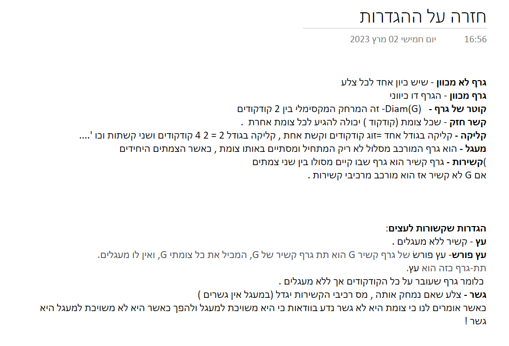

# Algorythms-2

A problem a day keeps the professor away




## BFS
```python
from collections import deque

def bfs(graph, start):
    visited = set()
    queue = deque([start])

    while queue:
        vertex = queue.popleft()
        print(vertex, end=" ")  # Process or visit the current vertex
        visited.add(vertex)

        for neighbor in graph[vertex]:
            if neighbor not in visited:
                queue.append(neighbor)
                visited.add(neighbor)

# Example usage:
# Define the graph as an adjacency list
graph = {
    'A': ['B', 'C'],
    'B': ['A', 'D', 'E'],
    'C': ['A', 'F'],
    'D': ['B'],
    'E': ['B', 'F'],
    'F': ['C', 'E']
}

start_vertex = 'A'
print("BFS traversal:")
bfs(graph, start_vertex)
```
The bfs function takes a graph represented as a list and a starting vertex.

It performs the BFS and prints the vertices in the order they are visited.

The visited set is used to keep track of the visited vertices, and the queue is a deque (double-ended queue) used to store the vertices to be processed. The algorithm starts with the start vertex, adds it to the queue and the visited set, then enters a loop.

In each iteration of the loop, it dequeues a vertex from the left end of the queue, processes or visits that vertex, and adds its unvisited neighbors to the queue and the visited set. This process continues until the queue is empty.

In the example usage, an example graph is defined as an adjacency list, and the BFS traversal is performed starting from vertex 'A'. The resulting traversal order is printed. 


## DFS
```python
def dfs(graph, start, visited=None):
    if visited is None:
        visited = set()
    print(start, end=" ")  # Process or visit the current vertex
    visited.add(start)
    for neighbor in graph[start]:
        if neighbor not in visited:
            dfs(graph, neighbor, visited)

# Example usage:
# Define the graph as an adjacency list
graph = {
    'A': ['B', 'C'],
    'B': ['A', 'D', 'E'],
    'C': ['A', 'F'],
    'D': ['B'],
    'E': ['B', 'F'],
    'F': ['C', 'E']
}

start_vertex = 'A'
print("DFS traversal:")
dfs(graph, start_vertex)
```

In this code, the dfs function takes a graph represented as an adjacency list, a starting vertex, and a set of visited vertices (which defaults to None if not provided). It performs the DFS traversal and prints the vertices in the order they are visited.

The algorithm uses recursion to explore the graph. 
It starts with the start vertex, marks it as visited, and prints it. Then, for each unvisited neighbor of the current vertex, it recursively calls the dfs function to visit that neighbor and its neighbors, until all vertices have been visited.

In the example usage, an example graph is defined as an adjacency list, and the DFS traversal is performed starting from vertex 'A'. The resulting traversal order is printed.
